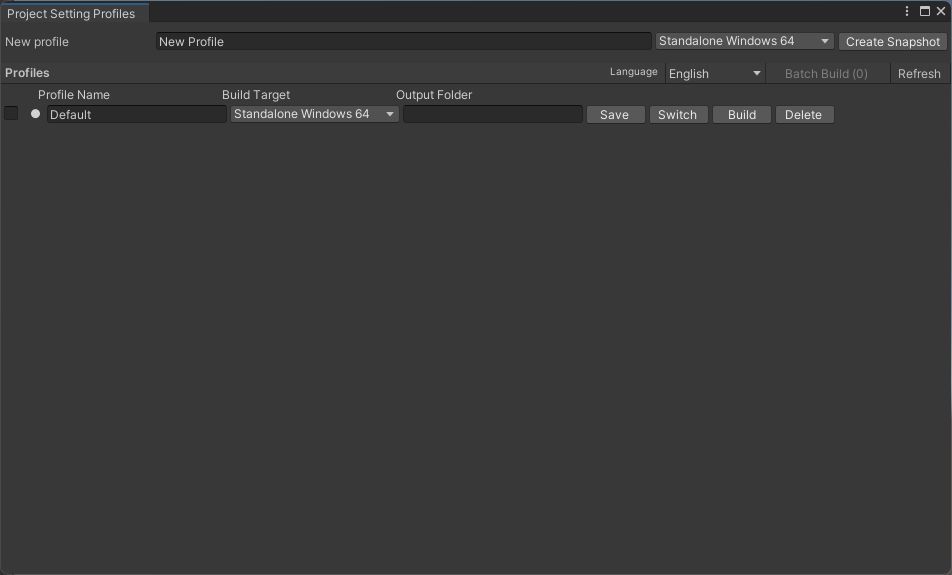
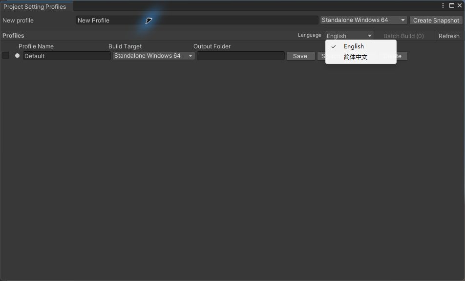
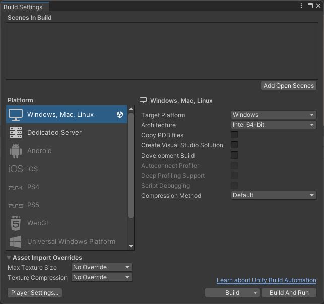
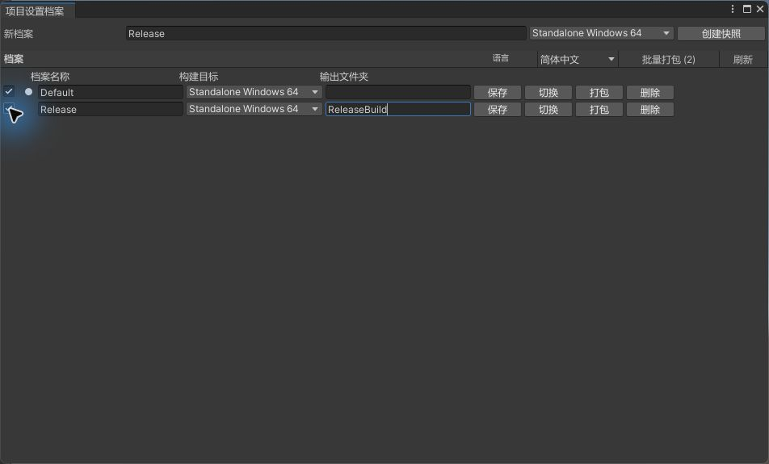
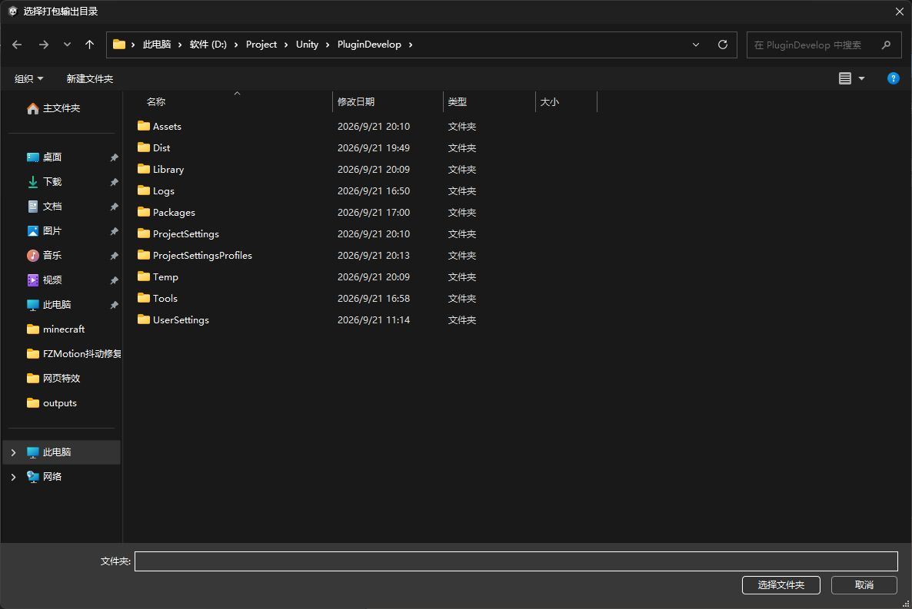

# Project Setting Profiles: illustrated guide

Screenshots below were captured from the running plugin in Unity 2022.3.62f3 on Windows. Platform choices and native folder dialogs may look different on other systems. The `Default` and `Release` rows are examples from the development project, not profiles shipped with the package.

## 简体中文教程

### 1. 安装并打开窗口

在 Unity 2022.3 或更新版本中，打开 **Window > Package Manager > + > Add package from git URL**，输入 `https://github.com/DarthCY-K/ProjectSettingProfiles-Unity.git`。也可通过 **Assets > Import Package > Custom Package** 导入单独发布的 `.unitypackage`。同一工程只选一种安装方式。安装完成后，点击 **Tools > Project Setting Profiles**。



语言默认是英文。在窗口的 **Language** 下拉菜单选择 **简体中文**；选择按当前用户保存，不改变 Unity 编辑器本身的语言。



### 2. 配好要保存的工程状态

先在 **File > Build Settings** 配置构建平台、场景顺序与勾选状态、**Development Build**、**Compression Method** 等，再按需要调整 **Edit > Project Settings**。下图是 Unity 的实际 Build Settings；示例工程此时场景列表为空，若要真正打包，应先点击 **Add Open Scenes** 或添加其他场景并确保至少一个场景启用。



### 3. 创建档案并更新快照

回到插件窗口，在最上方输入档案名称，选择构建目标，点击 **创建快照**。这会记录当前 `ProjectSettings` 树，以及插件支持的 Build Settings 场景和构建选项。为不同配置重复此步骤即可创建多个档案。

日后修改工程设置或 Build Settings 后，点击对应行的 **保存** 更新该档案。修改档案名称、构建目标或 **输出文件夹** 也要点击 **保存**，输入框本身不会立即持久化。已有旧档案需要重新保存一次，才能加入后续版本新增的构建参数。

下图的 `Release` 档案设置了 `ReleaseBuild` 输出文件夹；`Default` 留空，将使用自动生成的文件夹名。自定义名称与已有目录冲突时，插件追加 `_2`、`_3` 等后缀。



### 4. 切换档案

点击目标行的 **切换**，阅读覆盖提示并确认。插件先应用快照中的设置文件，再切换构建平台和 Build Settings；行首的小圆点表示上次成功应用的档案。切换会移除当前 `ProjectSettings` 中不属于快照的文件，因此先保存其他未提交的工程设置，必要时保留版本控制记录。切换期间不要进入 Play Mode。

### 5. 单档案或批量打包

单档案点击该行 **打包**；批量打包则勾选多行，再点击工具栏中的 **批量打包 (N)**。在弹出的原生对话框选择一个**已存在的输出根目录**，不要选在工程的 `Assets`、`ProjectSettings` 或 `ProjectSettingsProfiles` 内。点击 **取消** 则不会启动任务。



插件按照列表顺序逐个应用档案、等待 Unity 刷新/平台切换，然后打包启用的场景。每个档案放在输出根目录下独立子目录中；某项失败时队列停止，工程保留最后应用的档案。打包前确认已安装对应平台模块，且该档案保存的场景列表中至少有一个启用场景。截图中的示例未真正执行打包。

### 6. 接入切换完成回调（可选）

在 Editor 程序集中引用 `ProjectSettingProfiles.Editor`，通过 `ProfileSwitchEvents.AfterSwitch` 订阅。手动切换、单档案打包、批量打包的每个档案都会在切换成功后触发一次，打包在回调及随后可能发生的 Unity 刷新/编译结束后开始。

```csharp
using ProjectSettingProfiles;
using UnityEditor;
using UnityEngine;

[InitializeOnLoad]
internal static class BuildProfileHook
{
    static BuildProfileHook() { ProfileSwitchEvents.AfterSwitch += OnAfterSwitch; }

    private static void OnAfterSwitch(object sender, ProfileSwitchedEventArgs e)
    {
        Debug.Log($"Applied {e.ProfileName} ({e.ProfileIndex + 1}/{e.ProfileCount}), build={e.IsBuild}");
    }
}
```

档案数据在工程根目录 `ProjectSettingsProfiles/`，可自行纳入版本控制，不在插件安装包内。快照递归覆盖 `ProjectSettings` 下的文件，包括其他插件以后新增到该目录的设置；其他位置（如 `Assets`、`UserSettings`、`Library` 或工程外）的数据不会被通用捕获。`ProjectVersion.txt` 不会被切换。更多限制及回调字段见 [README](../README.md)。

## English walkthrough

### 1. Install and open

In Unity 2022.3 or newer, select **Window > Package Manager > + > Add package from git URL** and enter `https://github.com/DarthCY-K/ProjectSettingProfiles-Unity.git`. Alternatively, import the separately distributed `.unitypackage` via **Assets > Import Package > Custom Package**. Use only one installation method per project. Open **Tools > Project Setting Profiles**.


English is the default. The **Language** dropdown offers **简体中文**; this per-user preference does not change Unity's own language.


### 2. Prepare the settings to capture

Configure the platform, scene order and enabled states, **Development Build**, **Compression Method**, and other options in **File > Build Settings**. Set up **Edit > Project Settings** as needed. The example below has no scenes yet: before building, add scenes with **Add Open Scenes** or another method and enable at least one.


### 3. Create and maintain profiles

Enter a name at the top of the plugin window, choose a build target, and click **Create Snapshot**. Repeat for each configuration. After changing project or build settings, click **Save** on the relevant row to replace its snapshot. Editing a row's name, target, or **Output Folder** also requires **Save**. Save older profiles again to capture build fields introduced in later plugin versions.

In the example, `Default` has an empty output folder and uses the generated name. `Release` uses `ReleaseBuild`; collisions receive `_2`, `_3`, and so on.


### 4. Switch a profile

Click **Switch** on the desired row and confirm the overwrite prompt. The plugin applies its settings snapshot, switches the build target, and restores captured Build Settings. The small dot marks the last successfully applied profile. A switch removes current `ProjectSettings` files absent from the snapshot: save unsaved settings first, and keep a version-control record when appropriate. Do not enter Play Mode during a switch.

### 5. Build one or several profiles

Click a row's **Build** for a single profile. For a batch, check several rows and click **Batch Build (N)**. Choose an **existing output root** in the native folder picker, outside the project's `Assets`, `ProjectSettings`, and `ProjectSettingsProfiles`. **Cancel** starts no task.


Profiles run in list order: each is applied, Unity finishes refreshing/switching platform, and enabled scenes are built into a separate child folder. The queue stops on failure and leaves the last applied profile active. Install the target platform module and save at least one enabled scene in each profile before building. No build was run to make these screenshots.

### 6. Hook the completed switch (optional)

Reference `ProjectSettingProfiles.Editor` from your Editor assembly and subscribe to `ProfileSwitchEvents.AfterSwitch`. The C# example in the Chinese section above applies unchanged. Manual switches, single builds, and every item in a batch invoke the callback after a successful switch and before that item's build. `IsBuild`, zero-based `ProfileIndex`, `ProfileCount`, and `OutputDirectory` describe the operation; `OutputDirectory` is `null` for a manual switch. Subscribe again after domain reload, for example with `[InitializeOnLoad]`.

Profiles are stored under `<project>/ProjectSettingsProfiles/` and are not part of the plugin distribution. The snapshot recursively captures files in `ProjectSettings`, including future plugins' files there, but cannot generically capture settings outside that tree. `ProjectVersion.txt` is deliberately excluded. See the [README](../README.md) for details and limitations.
